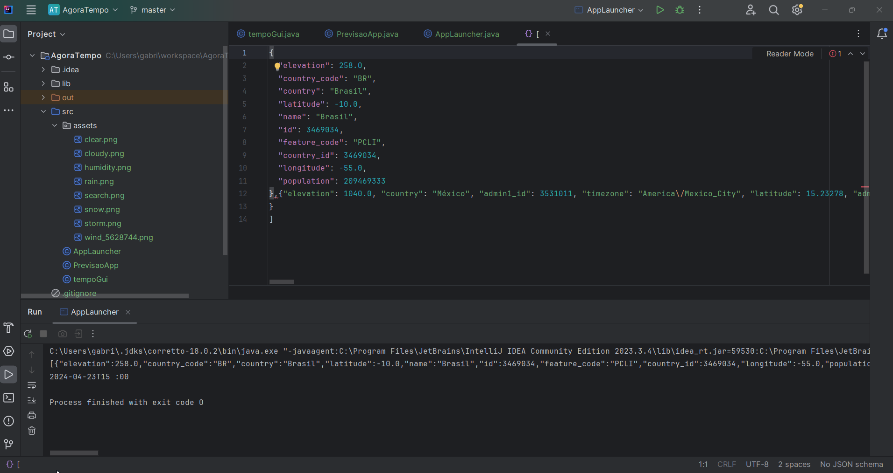

<!DOCTYPE html>
<html lang="en">
<head>
    <meta charset="UTF-8">
    <meta name="viewport" content="width=device-width, initial-scale=1.0">
    <title>Awesome README</title>
    
</head>
<body>
    

    <h1>Awesome README </h1>
    
A curated list of awesome READMEs

    <h2>Examples</h2>
    <ul>
        <li>
             
            
            
            
        </li>
    </ul>

    <h2>Credito</h2>
    
<a href="https://www.youtube.com/@TapTap_196">@TapTap_196</a> has waived all copyright.

</body>
</html>
